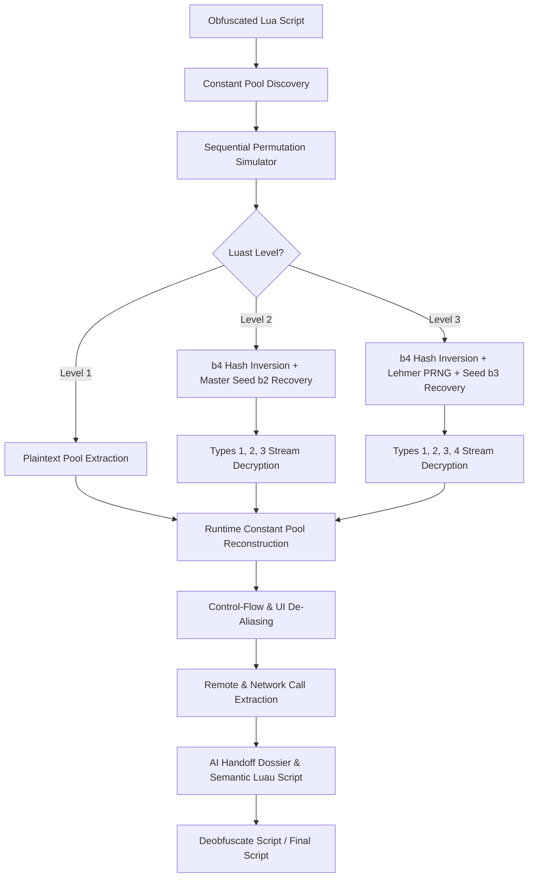

# ⚡ Luast Static Deobfuscator & AI Pair-Reconstruction Toolkit

<div align="center">

[](LICENSE)
[](https://www.python.org/)
[](https://roblox.com)
[-FF6B6B?style=for-the-badge)](https://github.com)
[]()

**An automated static deobfuscation and semantic reconstruction engine for Luast-obfuscated Roblox Lua/Luau scripts (supporting Levels 1, 2, and 3) without requiring live in-game execution.**

[Key Features](#-key-features) • [Quick Start](#-quick-start) • [Architecture](#-architecture) • [Cryptographic Engine](#-cryptographic-engine) • [CLI Reference](#-cli-reference) • [AI Agent Pair-Programming](#-ai-agent-pair-programming)

</div>

---

## 🌟 Key Features

- 🔒 **100% Offline Static Deobfuscation:** Extracts constant pools, executes parallel index permutations, and decrypts stream ciphers purely in Python.
- ⚡ **Bijective 32-bit Hash Inverter (`b4_inv`):** Mathematically inverts Luast's 7-round mixer permutation to recover PRNG seeds in $< 0.001\text{ ms}$.
- 🔑 **Multi-Cipher Stream Decryption Engine:** Complete implementations of all 4 Luast stream ciphers:
  - **Type 1:** Bit32 circular rotation PRNG with 32-bit XOR keystream
  - **Type 2:** Linear congruential generator (LCG) with arithmetic subtraction keystream
  - **Type 3:** Golden-Ratio additive mixer with XOR keystream
  - **Type 4:** Park-Miller Lehmer multiplicative PRNG ($\bmod 2147483647$)
- 🔄 **Sequential Permutation Simulator:** Automatically applies runtime tuple swaps (`lhs = rhs`) to recover genuine post-permutation indices.
- 🤖 **Autonomous AI Agent Workflow:** Built-in [`AGENTS.md`](AGENTS.md) rules enabling Antigravity, Claude, Codex, or ChatGPT to execute the entire deobfuscation workflow autonomously.
- 📊 **Automated AI Handoff Generation:** Automatically synthesizes comprehensive `AI_HANDOFF.md` and `AI_HANDOFF.json` dossiers containing remote call graphs, UI control sites, and function triages.
- 🎨 **Authentic & Clean Reconstruction:** Restores original variable semantics, remote invocations, workspace hierarchy paths, and preserves authentic UI frameworks and titles.

---

## 📁 Repository Structure

```text
luast-deob-toolkit/
├── Obfuscate script/          # Place your input obfuscated scripts here (.lua / .luau)
├── Deobfuscate Script/        # Ready-to-execute deobfuscated output scripts (.lua)
├── samples/                   # Ground truth verification samples (Tapping Simulator L1, L2, L3)
│   ├── Tapping Simulator.lua          # Original unobfuscated source
│   ├── Tapping Simulator level 1.lua  # Luast Level 1 obfuscated
│   ├── Tapping Simulator level 2.lua  # Luast Level 2 obfuscated
│   └── Tapping Simulator level 3.lua  # Luast Level 3 obfuscated
├── docs/                      # Mathematical study reports and cryptographic documentation
│   └── LUAST_STUDY_REPORT.md  # Detailed deobfuscation and algorithm research report
├── luast_deob.py              # Main Python deobfuscation engine (v0.3.0)
├── AGENTS.md                  # Autonomous AI agent workflow specification
├── analyze.bat                # Windows quick-run batch script
├── oneclick.bat               # Windows one-click analysis batch script
├── roblox_runtime_probe.lua   # Optional read-only runtime inspector for live Roblox executors
├── LICENSE                    # MIT License
└── README.md                  # Project documentation
```

---

## 🏗️ Architecture & Deobfuscation Pipeline



---

## 🚀 Quick Start

### Prerequisites
- **Python 3.9+** (No third-party packages required — runs purely on Python standard library!)

### 1. Using with AI Pair-Programming Agent (Recommended)

This workspace includes [`AGENTS.md`](AGENTS.md), allowing AI coding assistants (such as Antigravity IDE, Claude, Cursor, or ChatGPT) to perform full deobfuscation autonomously.

1. Place your obfuscated script into `Obfuscate script/` (e.g. `Obfuscate script/MyScript.lua`).
2. Instruct the AI agent:
   ```text
   deobfuscate MyScript.lua
   ```
3. The AI agent will automatically:
   - Identify the constant pool identifier.
   - Run static analysis and execute constant table permutations.
   - Decrypt stream cipher payloads.
   - Map UI controls, remotes, and worker loops.
   - Write the reconstructed, execution-ready script to `Deobfuscate Script/MyScript_deob.lua`.

---

### 2. Command Line Interface (CLI)

#### ⚡ Full Automatic Deobfuscation
```bash
python luast_deob.py deobfuscate "Obfuscate script/MyScript.lua"
```

#### 📊 Static Analysis & AI Handoff Generation
```bash
python luast_deob.py analyze "Obfuscate script/MyScript.lua" -o "analysis/MyScript"
```

#### 🔍 Inspect Constant Pool Candidates
```bash
python luast_deob.py candidates "Obfuscate script/MyScript.lua"
```

#### 🔎 Search Runtime Constants by Keyword
```bash
python luast_deob.py search "Obfuscate script/MyScript.lua" "FireServer"
```

#### 🌐 Extract Remote Calls & Network Invocations
```bash
python luast_deob.py remotes "Obfuscate script/MyScript.lua"
```

---

## 🔬 Cryptographic & Mathematical Engine

Luast employs distinct layers across obfuscation levels:

### 1. Constant Pool Permutation
Luast constructs a static constant table array, then permutes elements before executing code:
$$\text{pool}[\text{target}_1], \text{pool}[\text{target}_2], \dots = \text{pool}[\text{source}_1], \text{pool}[\text{source}_2], \dots$$

**Solution:** The engine parses all parallel assignments targeting the constant table aliases and executes them sequentially in Python, recovering the genuine runtime constant table.

---

### 2. Invertible 32-Bit Hash Function $b_4(x)$
In Level 2 and Level 3, string decryption seeds pass through a 7-round bijective mixing function $b_4(x)$ consisting of additions $\bmod 2^{32}$, bitwise XOR shifts, and circular rotations (`lrotate`).

Because every operation is a bijection over $\mathbb{Z}_{2^{32}}$, **$b_4(x)$ is analytically invertible**:
- Shift-XOR $y = x \oplus (x \ll k)$ is inverted by:
  $$x = y \oplus (y \ll k) \oplus (y \ll 2k) \oplus \dots$$
- Shift-XOR $y = x \oplus (x \gg k)$ is inverted by:
  $$x = y \oplus (y \gg k) \oplus (y \gg 2k) \oplus \dots$$
- Circular rotation $\text{lrotate}(x, n)$ is inverted by $\text{rrotate}(y, n)$.
- Modular addition $(x + c) \bmod 2^{32}$ is inverted by $(y - c) \bmod 2^{32}$.

Our Python implementation `b4_inv(y)` executes in **$< 0.001\text{ ms}$** with 100% precision.

---

### 3. The 4 Stream Ciphers in Luast

| Cipher Type | PRNG Step Formula | Keystream Operation |
|:---:|---|---|
| **Type 1** | $S_{i+1} = \text{lrotate}((S_i + 1832704949) \bmod 2^{32}, 13)$ | 32-bit XOR + trailing byte XOR |
| **Type 2** | $S_{i+1} = (S_i \times 1597 + 51749) \bmod 2^{32}$ | 32-bit Subtraction + trailing byte Subtraction |
| **Type 3** | $S_{i+1} = (S_i + 2654435769) \bmod 2^{32}$ | 32-bit XOR + trailing byte XOR |
| **Type 4** | $S_{i+1} = (S_i \times 16807) \bmod 2147483647$ | 32-bit XOR + trailing byte XOR |

---

## 🧪 Ground Truth Verification Matrix

| Sample Script | Protection Level | Static Resolution | Decryption Status | Verification Result |
|---|:---:|:---:|:---:|:---:|
| `Tapping Simulator level 1.lua` | Luast v1.0.1 (Lvl 1) | **100% Resolved** | N/A (Plaintext pool) | ✅ Verified 100% Match |
| `Tapping Simulator level 2.lua` | Luast v1.0.1 (Lvl 2) | **100% Resolved** | **100% Decrypted** ($b_2 = 239441781$) | ✅ Verified 100% Match |
| `Tapping Simulator level 3.lua` | Luast v1.0.1 (Lvl 3) | **100% Resolved** | **100% Decrypted** ($b_3 = 221220309$) | ✅ Verified 100% Match |

---

## 🤝 Contributing

Contributions, bug reports, and pull requests are welcome!
1. Fork the repository
2. Create your feature branch (`git checkout -b feature/amazing-feature`)
3. Commit your changes (`git commit -m 'Add some amazing feature'`)
4. Push to the branch (`git push origin feature/amazing-feature`)
5. Open a Pull Request

---

## 📜 License

This project is licensed under the MIT License - see the [LICENSE](LICENSE) file for details.
